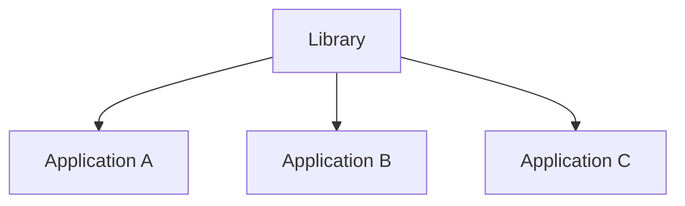

# Description
A system consists of three different applications along with a shared Library system all of which are kept in separate repositories.

## Scenario
Each of the applications has a different stakeholder, but your company is responsible for the creation and maintenance
of each application. To simplify the codebase, a library system created with shared code that is used in all three 
applications to prevent code duplication.

The stakeholder of Application A requests a major change to their application which will require you to make changes to 
to the library system. How do you go about implementing these changes?

The system can be simplistically represented as below:

### Additional information
 - Applications could consist of different frameworks/languages
 - Changes to an application may not be applied without the prior consent of the clients that pay for those services
 - Deployments are handled by automated deployment pipelines after code changes have been merged
 
 ### Assignment
 Answer the question presented in the Scenario section by means of a branch based on main. 
 Make use of text, voice notes, videos, diagrams, or anything else that will help you answer the question
 and get your point across.

The candidate is not expected to spend longer than 15 minutes on this question, however, the canidate is allowed to spend more time.